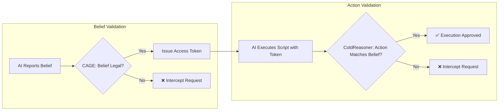

<div align="center">
    
[English](README.md) | [Chinese](README.zh.md)

</div>

<div align="center">

# ColdReasoner-F

**Formal Behavioral Verification · Minimal Prototype**

</div>

<div align="center">

[](https://github.com/cold-os/ColdReasoner-F)
[](https://opensource.org/licenses/Apache-2.0)
[](https://www.python.org/)
[](https://github.com/Z3Prover/z3)

</div>
```
ColdReasoner-F is a minimized, refined implementation of the ColdReasoner runtime verification core. Centered on a file management scenario, it strips away abstract philosophical reasoning and returns to engineering fundamentals: **a functional, verifiable AI behavior and access control system built atop the Z3 constraint solver.**

The system operates via a three-stage closed-loop mechanism of *Belief – Token – Action*. The AI reports its intent (Belief) to the CAGE gateway; upon validating legality, CAGE issues an access Token; the AI may only execute target scripts when holding a matching Token. Any deviation across the pipeline — illegal declared beliefs, token abuse, or unauthorized actions — will be captured and rejected by mathematical constraints encoded within ColdReasoner.

> **⚠️ Design Positioning**
>
> This project is a minimal conceptual prototype. Its core objective is to formally encode the "belief-action consistency" verification paradigm into decidable logical constraints via the Z3 constraint solver. It is not a full-fledged runtime system, contains no network communication modules or real-world privilege management logic, and is constructed solely to validate the engineering feasibility of the formal verification kernel.

---

## Core Design


### Scenario Definition
The system abstracts a file system model with a closed set of formally defined actions and corresponding belief predicates:

| Type | Belief / Action | Status |
|------|-----------------|--------|
| Legal Beliefs | READ, WRITE | ✅ Allowed to report |
| Illegal Beliefs | DELETE, MODIFY | ❌ Forbidden to report |
| Legal Actions | READ, WRITE | ✅ Allowed (with temporal constraints) |
| Conditional Action | DELETE | ⚠️ Allowed only if READ occurred before |
| Illegal Action | MODIFY | ❌ Permanently forbidden |

### Formal Validation Rules
**Rule 1: Belief Legality** – Only READ and WRITE are legal to report; DELETE and MODIFY as beliefs are permanently forbidden.

**Rule 2: Belief-Action Mapping** (forward implication) – Reporting READ allows either READ or DELETE actions; reporting WRITE allows only WRITE. No reverse implication is enforced (i.e., executing DELETE does not require reporting DELETE).

**Rule 3: Temporal Constraints** –
- Executing DELETE requires at least one READ action in the history.
- Consecutive WRITE actions are prohibited.

**Rule 4: Token Issuance** – Upon successful verification, a concrete Token object with the corresponding permission scope is issued; tokens can be revoked later.

> **Note**: This implementation enforces strict exact matching rather than relaxed semantic equivalence. Beliefs and actions form a bijective one-to-one mapping; for instance, declaring a `READ` belief exclusively permits execution of the `READ` script. This design intentionally abandons the approximate matching scheme from early ColdReasoner iterations to improve decidability for engineering deployment.

---

## Quick Start
### Prerequisites
- Python 3.8 or newer
- Z3 Solver

### Installation & Execution
```bash
pip install z3-solver
python cold_reasoner_f.py
```

### Sample Console Output
```
=== Runtime Incremental Verification ===

--- Step 1: belief=READ, action=READ ---
[EXEC] READ test.txt
✅ Verification passed, token T-0 issued

--- Step 2: belief=WRITE, action=WRITE ---
[EXEC] WRITE test.txt with 'new content'
✅ Verification passed, token T-1 issued

--- Step 3: belief=READ, action=DELETE ---
[EXEC] DELETE test.txt
✅ Verification passed, token T-2 issued

--- Step 4: belief=WRITE, action=WRITE ---
[EXEC] WRITE test.txt with 'new content'
✅ Verification passed, token T-3 issued

--- Step 5: belief=READ, action=READ ---
[EXEC] READ test.txt
✅ Verification passed, token T-4 issued
```

### Result Semantics
| Solver Output | Formal Meaning |
|---------------|----------------|
| `sat` | A valid combination of beliefs and actions exists that satisfies all encoded formal constraints |
| `unsat` | The hypothesized execution trace violates at least one validation rule; the trace is rejected by CAGE/ColdReasoner |

---

## Project Structure
```
ColdReasoner-F/
└── cold_reasoner_f.py    # Single-file implementation: Z3 constraint encoding + test suite
```
All functional logic is consolidated into a single source file for simplified readability, modification, and extension.

---

## Evolution: From Theoretical Paper to Engineering Implementation
This prototype delivers an engineering-focused refinement of the original ColdReasoner theoretical framework:

| Dimension | Previous Design (ColdReasoner) | This Implementation (ColdReasoner-F) |
|-----------|-------------------------------|--------------------------------------|
| Verification Layers | Three (belief legality / action consistency / approximate matching) | Static rules (belief legality + forward mapping) + temporal constraints |
| Mapping Relation | Approximate (semantic distance) | One-to-many forward mapping (READ → READ/DELETE, WRITE → WRITE) |
| Temporal Logic | Not covered | Supports history-based constraints (e.g., READ before DELETE) |
| Token Mechanism | Implicit | Concrete Token objects (scope, revoked, etc.) |
| Execution Hooks | None | Real pre‑defined scripts invoked upon success |
| Philosophical Background | Includes Cold Existence Model, etc. | Completely stripped, pure engineering |

The prototype retains ColdReasoner’s core thesis: **AI behavior regulated via external formal contractual constraints**, while formalizing the paradigm into runnable, verifiable, auditable mathematical logic.

---

## Core Limitations
### 1. Expressive Power of Formal Logic
Currently only simple temporal constraints (finite rules based on history) are included; full LTL/CTL property verification is not yet supported, and modal logic is not covered.

### 2. Restricted Application Domain
The formal model is specialized exclusively for file system read/write/delete/modify workflows. Generalization to alternative agent domains (e.g., dialogue systems, autonomous LLM agents) requires full redefinition of belief spaces, action spaces, and cross-domain mapping rules.

### 3. Deployment Constraints
No native integration with large language model (LLM) APIs or OS-level privilege enforcement subsystems. This artifact serves solely as a conceptual verification prototype and is unsuitable for production-grade deployment.

---

## AI Utilization Statement
Source code implementation for this project was completed through collaborative work between human authors and AI auxiliary tools.

**Human Author Contributions**:
- Core architectural design: closed-loop Belief-Token-Action pipeline
- Formal logical definition of validation rules (two-layer verification, exact matching replacing approximate semantics)
- Scenario abstraction and comprehensive test suite design

**AI Auxiliary Contributions**:
- Source code implementation and debugging
- Syntax standardization and formatting optimization
- Automated test case generation

Human authors bear full engineering responsibility for the correctness of the final source code artifact.

---

## Tech Stack
- **Constraint Solver**: Z3 4.16.0
- **Programming Language**: Python 3.8+

---

## Future Extension Roadmap
- Integrate LLM interfaces to ingest real-time model outputs as runtime belief predicates
- Introduce dynamic file system state predicates (e.g., preconditions such as "target file exists")
- Extend formal rule set with temporal constraints and inter-action dependency invariants
- Replace standalone Z3 batch solving with a continuous runtime monitoring engine for incremental stream verification

---

## License
Apache 2.0
