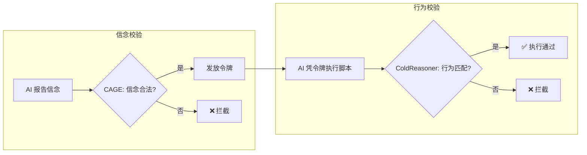

<div align="center">
    
[English](README.md) | [中文](README.zh.md)

</div>

<div align="center">

# ColdReasoner-F

**形式化行为验证 · 最小原型**

</div>

<div align="center">

[](https://github.com/cold-os/ColdReasoner-F)
[](https://opensource.org/licenses/Apache-2.0)
[](https://www.python.org/)
[](https://github.com/Z3Prover/z3)

</div>

ColdReasoner-F 是 ColdReasoner 运行时验证内核的**最小化精炼实现**。它以文件管理为场景，剥离哲学思辨，回归工程本质——**用Z3约束求解器，实现一个可运行、可验证的AI行为权限控制系统。**

系统核心机制为“信念-令牌-行为”的三步闭环：AI向CAGE网关报告意图（信念），CAGE校验合法性后发放令牌，AI凭令牌执行对应脚本。任何环节的偏离——信念非法、令牌滥用、行为越权——都将被ColdReasoner的数学约束捕获并拒绝。

> **⚠️ 设计定位**
>
> 本项目是一个**极简概念原型**，旨在将“信念-行为一致性”的校验思想，用Z3约束求解器精确编码为可判定的逻辑约束。它不是完整运行时系统，不涉及网络通信或真实权限管理，仅为验证逻辑内核的工程可行性而设计。

---

## 核心设计



### 场景定义

系统管理一个“文件系统”，定义如下行为与信念的闭集：

| 类型 | 信念/行为 | 状态 |
|------|-----------|------|
| 合法 | READ | ✅ 允许报告并执行 |
| 合法 | WRITE | ✅ 允许报告并执行 |
| 非法 | DELETE | ❌ 禁止报告或执行 |
| 非法 | MODIFY | ❌ 禁止报告或执行 |

### 校验规则

**规则1：信念合法性**：信念不得包含在非法闭集中（DELETE / MODIFY 不可报告）。

**规则2：信念-行为一致性**：
- 正向：报告信念 X → 必须执行对应的精确行为 X
- 反向：执行行为 X → 必须此前报告了对应的信念 X

**规则3：令牌发放**：当且仅当信念合法时，CAGE 发放令牌。

> **注意**：本实现采用“精确匹配”而非“近似相等”。信念与行为之间是一对一的映射关系，例如报告 `READ` 只能执行 `READ` 脚本。这与 ColdReasoner 早期“近似相等”的设计不同，是面向工程可判定性的有意简化。

---

## 快速开始

### 环境要求

- Python 3.8+
- Z3 Solver

### 安装与运行

```bash
pip install z3-solver
python cold_reasoner_f.py
```

### 输出示例

```
=== 测试1 (通过): 流程闭环 (READ) ===
校验结果: sat
  [AI报告信念]: ['READ']
  [CAGE令牌状态]: 发放
  [实际执行脚本]: ['READ']
  ✅ 流程闭环: 信念(READ) -> 令牌 -> 执行(READ) 匹配

=== 测试2 (拦截): 信念非法 (DELETE) ===
校验结果: unsat
  ❌ 流程被 CAGE/ColdReasoner 拦截: 检测到非法行为或信念

=== 测试3 (拦截): 信念-行为不匹配 (READ vs DELETE) ===
校验结果: unsat
  ❌ 流程被 CAGE/ColdReasoner 拦截: 检测到非法行为或信念

=== 测试4 (拦截): 执行非法脚本 (MODIFY) ===
校验结果: unsat
  ❌ 流程被 CAGE/ColdReasoner 拦截: 检测到非法行为或信念

=== 测试5 (通过): 空闲状态 ===
校验结果: sat
  [AI报告信念]: 无
  [CAGE令牌状态]: 未发放
  [实际执行脚本]: 无
```

### 结果解读

| 结果 | 含义 |
|------|------|
| `sat` | 存在一组合法的信念-行为组合，满足所有约束 |
| `unsat` | 当前假设违反至少一条规则，被 CAGE/ColdReasoner 拦截 |

---

## 项目结构

```
ColdReasoner-F/
└── cold_reasoner_f.py    # 单文件实现：Z3约束定义 + 测试用例
```

所有代码均在一个文件中，方便阅读、修改与扩展。

---

## 从论文到代码：演进说明

本项目是对先前 ColdReasoner 概念的**工程化精炼**：

| 维度 | 先前论文 (ColdReasoner) | 本实现 (ColdReasoner-F) |
|------|-------------------------|------------------------|
| 校验层数 | 三层（信念合法性 / 行为自洽 / 近似一致性） | 两层（信念合法性 / 信念-行为精确匹配） |
| 近似处理 | 语义距离 `δ` 与阈值 `T` | 移除，改用精确映射 |
| 令牌机制 | 隐含 | 显式建模为 `token_granted` 布尔变量 |
| 哲学思辨 | 包含冷存在模型等背景 | 完全剥离，纯工程表达 |
| 执行载体 | 自然语言描述 | Z3可判定约束，直接可运行 |

本实现保留了 ColdReasoner 的核心思想——**通过外部契约约束AI行为**——但将其形式化为可运行、可验证、可审计的数学约束。

---

## 核心局限

### 逻辑表达力
当前仅为命题逻辑级别的约束校验，未涉及时态逻辑（如“动作顺序”）或模态逻辑（如“应当”“可能”）。已验证的属性仅限于静态行为一致性，不覆盖动态系统性质。

### 场景范围
仅针对文件读/写/删/改这一特定场景设计，泛化到其他领域（如对话系统、自主Agent）需重新定义信念空间、行为空间与映射关系。

### 实际部署
未集成真实LLM接口或操作系统权限管理，仅为概念验证原型，不适用于生产环境。

---

## 人工智能使用声明

本项目的代码实现由人类作者与 AI 辅助工具协作完成。

**人类作者贡献**：
- 核心架构设计：信念-令牌-行为的闭环模型
- 校验规则的逻辑定义（两层校验、精确匹配取代近似）
- 场景抽象与测试用例设计

**AI 辅助贡献**：
- 代码实现与调试
- 语法修正与格式优化
- 测试用例生成

最终代码的正确性与工程责任由人类作者承担。

---

## 技术栈

- **约束求解器**: Z3 4.16.0
- **语言**: Python 3.8+

---

## 下一步扩展方向

- 集成 LLM 接口，使“信念”来自模型实时输出
- 增加文件系统状态的动态变化（如“文件已存在”等前置条件）
- 扩展校验规则，支持时序约束与依赖关系
- 替换 Z3 为运行时监控引擎，实现连续校验而非单次判定

---

## 许可证

Apache 2.0
